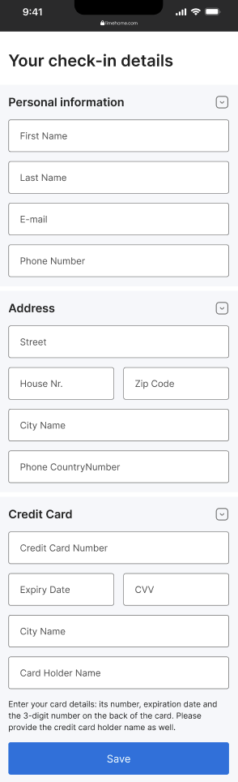
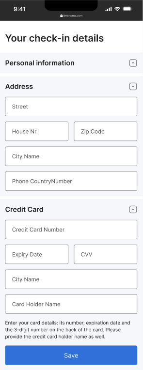

# Limehome challenge - Frontend Engineer

Thanks for taking the time to solve our challenge.
The task is designed to assess your interest, problem-solving skills and experience. We want to see your code, your approach, and your talent.

## Our challenge

The goal of this challenge is to improve existing UI/UX of the form, paying attention on proper authoring of HTML, accessibility and design implementation. 

We expect you to spend on it **no more than 2 hours** in total, although you’re free to use more time if you want or also mention what’s left to finish the given task in code comments or README. So **keep it simple**, but also remember to **show off your skills**. We want to see what you can do. 

We expect you to submit a **link to your code** (GitHub, GitLab, etc.).

### What we expect:

- Mobile-first UI adjustments: implement the provided [design](#design-materials) as close as possible using a mobile-first approach. The design should be responsive and adjust seamlessly to different screen sizes.
- Accessibility improvements: identify accessibility issues on the provided page and make the necessary adjustments to ensure that the form is accessible. Feel free to use [design](#design-materials) as a main reference, but if needed you can also implement your own suggestions. 
- Accordion functionality: ensure that the accordion on the page works as expected (expand and collapse sections) and there is no errors in the console.  

### What we check: 

- Functionality
- Accessibility best practices (e.g. usage of labels in the form)
- Design implementation (e.g. responsive design)
- Code quality (e.g. code style)

### Design materials

Could be found in [assets](src/assets) folder.

**Form design with opened accordions**

 

**Form design with closed accordion**



**Arrow icon for accordion**


## Technology

### Pre-requsites to run the project

* You have latest stable version of [Node](https://nodejs.org/en/download/) installed
* This project is in Angular, so you need to have [Angular CLI](https://github.com/angular/angular-cli) installed to run the project

```
npm install -g @angular/cli
```

### Development server

Run `ng serve` for a dev server. Navigate to `http://localhost:4200/`. The application will automatically reload if you change any of the source files.

### Code scaffolding

Run `ng generate component component-name` to generate a new component. You can also use `ng generate directive|pipe|service|class|guard|interface|enum|module`.

### Build

Run `ng build` to build the project. The build artifacts will be stored in the `dist/` directory.

### Running unit tests

Run `ng test` to execute the unit tests via [Karma](https://karma-runner.github.io).

### Running end-to-end tests

Run `ng e2e` to execute the end-to-end tests via a platform of your choice. To use this command, you need to first add a package that implements end-to-end testing capabilities.

### Further help

To get more help on the Angular CLI use `ng help` or go check out the [Angular CLI Overview and Command Reference](https://angular.io/cli) page.

<hr />

If you have any questions or feedback about the challenge, don't hesitate to reach out to us: tech-hiring@limehome.com
Good luck with the challenge! We are looking forward to your solution!